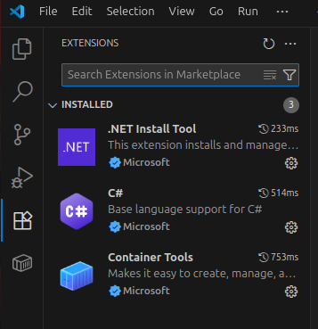

# VS Code extensions

[https://code.visualstudio.com/](https://code.visualstudio.com/)

[https://marketplace.visualstudio.com/](https://marketplace.visualstudio.com/)

# Create project
`dotnet new webapi --use-controllers --use-program-main`

# Add .gitignore
`dotnet new gitignore`

# Add Entity Framework Core SQLite provider
`dotnet add package Microsoft.EntityFrameworkCore.Sqlite`

[https://www.nuget.org/packages/Microsoft.EntityFrameworkCore.Sqlite/](https://www.nuget.org/packages/Microsoft.EntityFrameworkCore.Sqlite/)

# Run project
`donet watch`

# Build image
`podman build --tag api-example .`

# Run container
`podman run --detach --tty --rm --network=host --name api-example localhost/api-example`

# Delete all images
`podman rmi $(podman images -qa) -f`
